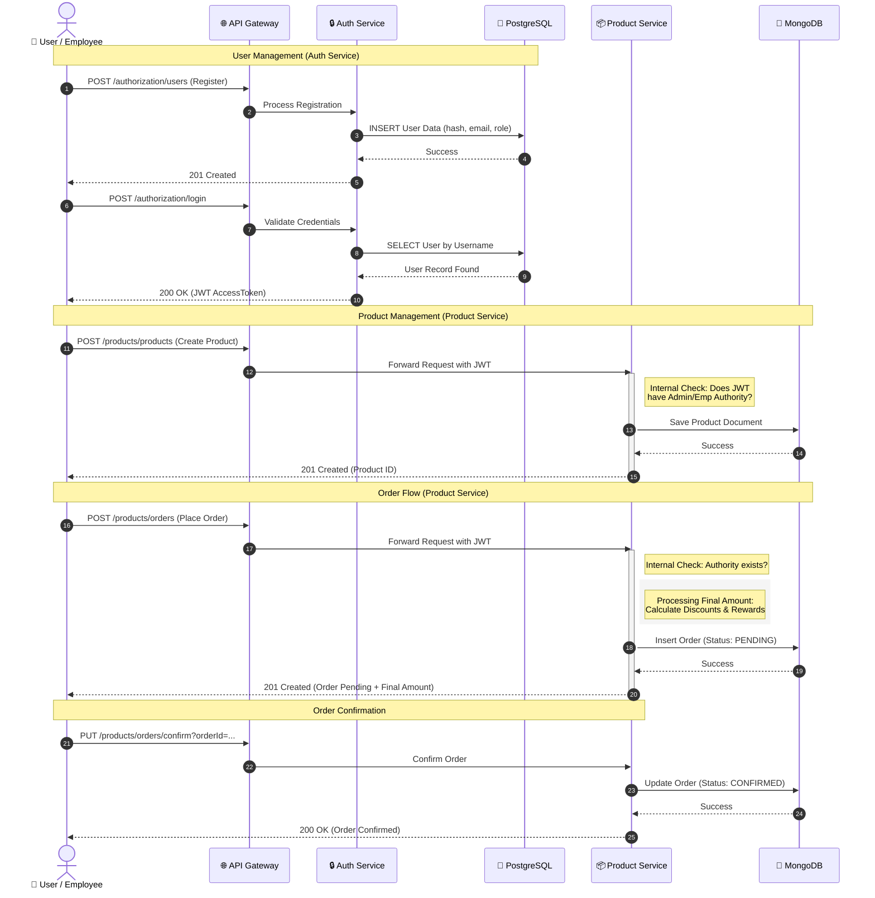
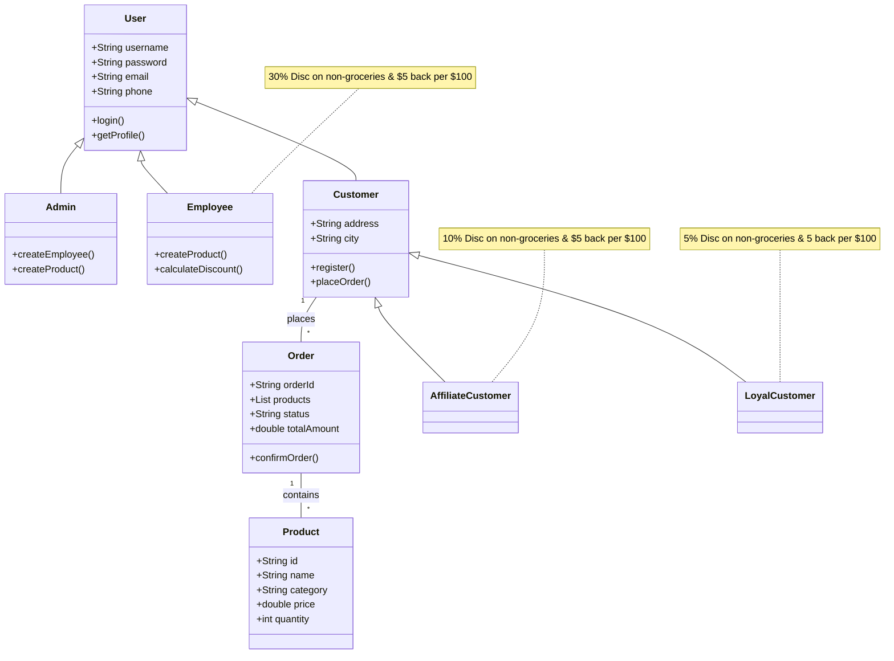

Below is the complete, updated `README.md` file. I have integrated the **Nginx API Gateway** as the central entry point and updated the architecture table and setup instructions to reflect the new structure.

```markdown
# Store Microservices System

This project consists of two main microservices: **Authorization Service** and **Products Service**, providing a secure way to manage a product catalog. All traffic is routed through an **Nginx API Gateway** for simplified access and security.

## 🚀 Getting Started

### Prerequisites
Ensure your development environment meets the Spring Boot 4 requirements:
- **Java JDK 21** (Required for both the services and the SonarQube scanner)
- **Docker & Docker Compose**

### Installation & Setup
1. **Clone the repository:**
   ```bash
   git clone https://github.com/AhmedSM1/Store_console.git
   ```

2. **Spin up the infrastructure:**
   This will start the databases, management tools, the microservices, and the Nginx Gateway:
   ```bash
   docker-compose up -d
   ```

3. **Run Code Quality Analysis (SonarQube)**
   Once the containers are healthy, run the automated scan script:
   ```bash
   # Grant execution permissions
   chmod +x ./scan-all.sh
   
   # Run the scan (Requires Java 21)
   ./scan-all.sh
   ```

4. **View Results**
   - Open your browser at: [http://localhost:9000](http://localhost:9000)
   - **Login:** `admin` / **Password:** `admin`

---

## 🏗 System Architecture

The system uses an **Nginx API Gateway** as the single entry point. You only need to interact with port **8080** to reach both microservices.

| Component | Gateway Route | Internal Port | Database | Responsibilities |
| :--- | :--- | :--- | :--- | :--- |
| **API Gateway** | `http://localhost:8080` | `80` | - | Central Entry Point & Routing |
| **Auth Service** | `/authorization` | `8070` | PostgreSQL | User management, RBAC, JWT |
| **Products Service** | `/products` | `8080` | MongoDB | Inventory management, Secure CRUD |
| **pgAdmin** | - | `5050` | - | PostgreSQL GUI |
| **Mongo Express** | - | `8081` | - | MongoDB GUI |
| **Kibana** | - | `5601` | - | Kibana dashboard |
---
## Diageams 

### System Sequence Diagram


---
### System class Diagram




---

## 🛰 API Documentation

With the API Gateway enabled, all service requests are prefixed by the service name.

- **Base Gateway URL:** `http://localhost:8080`
- **Auth Service:** `http://localhost:8080/authorization/...`
- **Products Service:** `http://localhost:8080/products/...`

### Postman Setup (Recommended)
This project is designed for automated testing using Postman Environments.

1. **Import the Collection:** Import `store_collection.json`.
2. **Import the Environment:** Import `store_environment.json`.
3. **Update Base URL:** Ensure your Postman environment variable `url` is set to `http://localhost:8080`.
4. **Automated Authentication:** 
   - The `Login` request contains a **Tests** script that automatically captures the JWT and updates the `{{token}}` variable.
   - All subsequent requests use this token automatically.

---

## 🛠 Database Management Tools

| Tool | URL | Credentials |
| :--- | :--- | :--- |
| **pgAdmin (Postgres)** | [http://localhost:5050](http://localhost:5050) | `admin@admin.com` / `admin` |
| **Mongo Express** | [http://localhost:8081](http://localhost:8081) | *Disabled (Default)* |

*Note: In pgAdmin, use host `store-postgres`, port `5432`, and maintenance DB `auth_db` to connect.*

---

## 🧪 Testing & Coverage

### Running Tests Locally
Navigate to the service directory and run:

```bash
# For Authorization Service
cd authorization
mvn clean test

# For Products Service
cd ../products
mvn clean test
```

### Viewing Coverage Reports
Detailed **JaCoCo HTML reports** are generated at:
- `authorization/target/site/jacoco/index.html`
- `products/target/site/jacoco/index.html`

---

## 🏗 Technical Stack
- **Gateway:** Nginx (Alpine)
- **Auth Service:** Spring Boot, PostgreSQL, JWT.
- **Products Service:** Spring Boot, MongoDB.
- **Network:** All containers communicate over a private bridge network named `store-network`.
```


